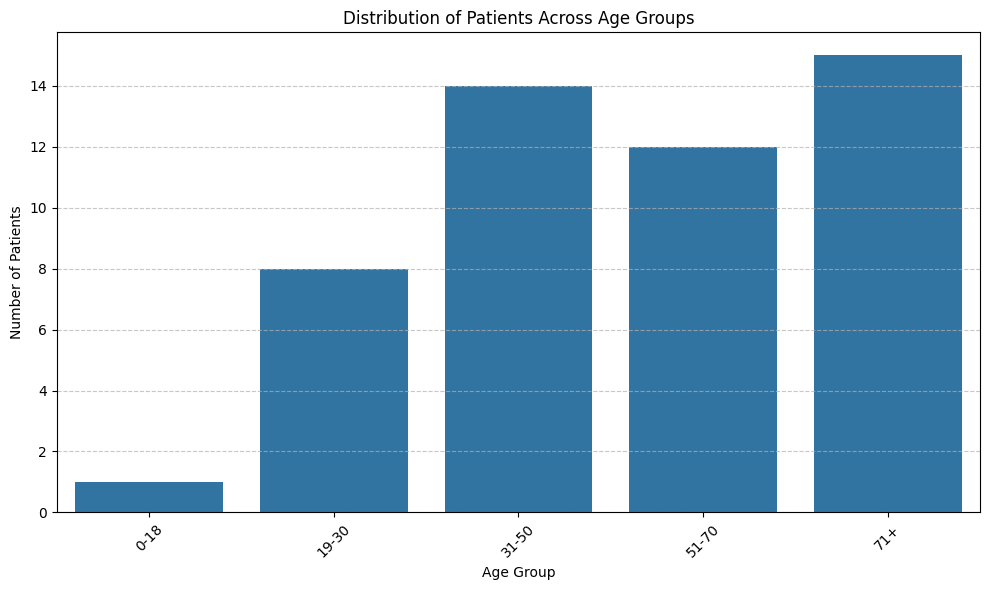
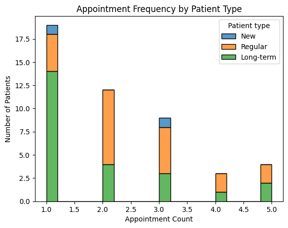
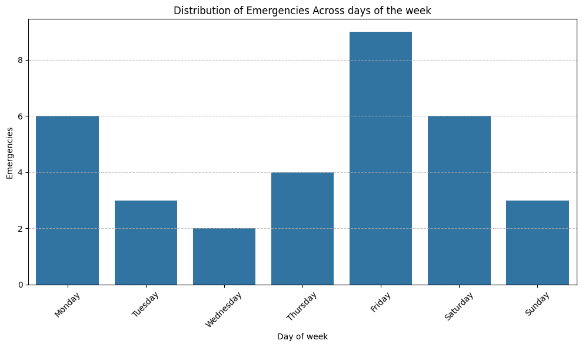
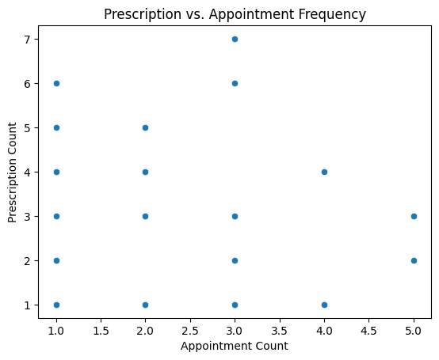

# Data pipeline documentation

## Any data quality issues encountered and how you handled them

- There is no data about categories of medications.
- Null values in some key columns for analysis.

# Analysis Results

## Analysis of Patient Distribution Across Age Groups

### 📊 Bar Chart Overview

### 🧮 Statistical Summary

Five people were not included in this analysis due to a lack of their age.

| Age Group | Number of Patients | Percentage of Total |
|-----------|--------------------|---------------------|
| 0–18      | 1                  | 2.6%                |
| 19–30     | 8                  | 20.5%               |
| 31–50     | 14                 | 35.9%               |
| 51–70     | 12                 | 30.8%               |
| 71+       | 15                 | 38.5%               |
| **Total** | **50**             | **100%**            |

- **Mean** number of patients per group: **10**
- **Median**: **12**
- **Standard Deviation** (approx.): **5**
- **Skewness**: Slight right skew due to low count in 0–18 group

### 🔍 Observations

- **The 71+ age group** has the highest number of patients (**15**), representing **38.5%** of all patients.
- **The 0–18 age group** has the lowest number of patients (**1**), accounting for only **2.6%**.
- The **31–50** and **51–70** age groups also show significant patient representation, with **14** and **12** patients, respectively.
- The **distribution** shows a trend toward a **higher concentration of older patients**, with relatively fewer young patients.

---

## Appointment Frequency by Patient Type

### 📊 Bar Chart Overview

### 🔍 Observations
- **Appointment count of 1** is the most frequent, especially among **Long-term** patients.
- **Regular** patients dominate counts **2–5**.
- **New** patients only appear at **count 1** and **count 3**.
- **Long-term** patients are more common in lower appointment frequencies (1–3), less in higher.
- Most patients, including **Long-term** ones, tend to have **only one appointment** recorded.
- **Regular** patients are consistently present across appointment counts, suggesting sustained engagement.
- **New** patient counts are low and limited in spread, as expected.

---

## Most Common Appointment Types by Age Group

### 📊 table Overview

| Age Group | Most Common Appointment Type | Count |
|-----------|------------------------------|-------|
| 0–18      | Consultation                 | 2     |
| 19–30     | Emergency                    | 8     |
| 31–50     | Consultation                 | 10    |
| 51–70     | Checkup                      | 14    |
| 71+       | Checkup                      | 13    |

### 🔍 Observations

- **Younger patients (0–30)**: Tend to come for **Consultations** or **Emergencies**.
- **Older patients (51+)**: Most commonly visit for **Checkups**, indicating proactive health management or chronic care.

---

## Emergency Appointment Distribution by Day of the Week

### 📊 Bar Chart Overview

### 🧮 Statistical Summary

| Day       | Emergency Count |
|-----------|------------------|
| Monday    | 6                |
| Tuesday   | 3                |
| Wednesday | 2                |
| Thursday  | 4                |
| Friday    | 9                |
| Saturday  | 6                |
| Sunday    | 3                |

### 🔍 Observations

- **Friday** sees the highest number of emergency visits (9), possibly indicating end-of-week urgency.
- **Wednesday** is the quietest day for emergencies (2).
- Weekends maintain moderate emergency volume, suggesting consistent after-hours needs.

---

## Most Prescribed Medication Categories by Age Group

### 🧮 Statistical Summary
A grouped aggregation reveals the most common medication type prescribed per age group:

| Age Group | Most Prescribed Category | Count |
|-----------|--------------------------|-------|
| 0–18      | Antibiotic               | 1     |
| 19–30     | Heart                    | 4     |
| 31–50     | Heart                    | 16    |
| 51–70     | Common                   | 10    |
| 71+       | Heart                    | 13    |

### 🔍 Observations

- **Heart medications** dominate across **19–30**, **31–50**, and **71+** age groups.
- **Young children (0–18)** mainly receive **antibiotics**.
- **Common** medications peak in the **51–70** age group, potentially for managing mild or chronic conditions.
- This trend aligns with the age-related rise in cardiovascular conditions, while younger patients tend to receive short-term or infection-related prescriptions.

---

## Prescription vs. Appointment Frequency

### 📊 Bar Chart Overview

#### Observations

- Most patients with **1–3 appointments** received **1 to 4 prescriptions**.
- A few outliers at **3 appointments** received **6 or 7 prescriptions**.
- There is **no strong linear relationship**, but clusters suggest patients with more appointments **tend to receive more prescriptions**.
- While not perfectly correlated, **increased appointment frequency** often leads to more prescriptions. This suggests consistent care enables broader diagnosis and medication management.

---

# Business Insights

## Age-Specific Healthcare Demand

- Younger groups (0–18, 31–50) most frequently attend consultations, whereas older adults (51+) prioritize checkups and receive more heart-related prescriptions.
- Younger adults (19-30) are using the most emergency rooms, if we take into account that Friday is the day when most people go to the emergency room. We can conclude, this group's night activities might cause this spike. 
- Implication: Allocate more cardiology and general checkup slots for older patients, and ensure consultation availability for younger demographics.

## Emergency Visits Spike on Fridays

Emergency appointments peak sharply on Fridays, potentially due to limited weekend availability or late symptom escalation.

Implication: Consider extending Friday hours or enhancing triage and urgent care staffing towards week’s end to reduce overload.

## Prescription Volume Increases with Appointment Frequency

A pattern suggests more frequent appointments are associated with higher prescription counts, indicating a possible link between regular visits and proactive treatment.

Implication: Encourage consistent follow-ups, especially for chronic care patients, to manage prescriptions more effectively.